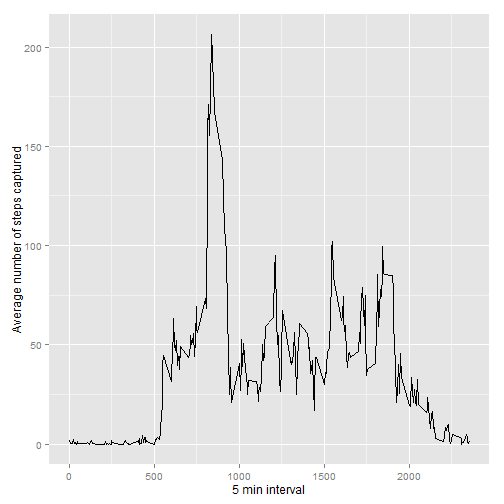
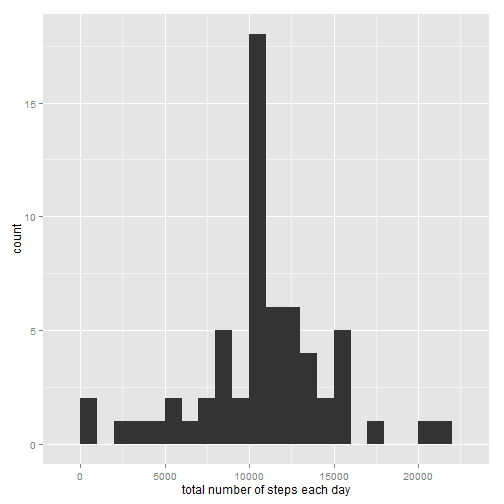
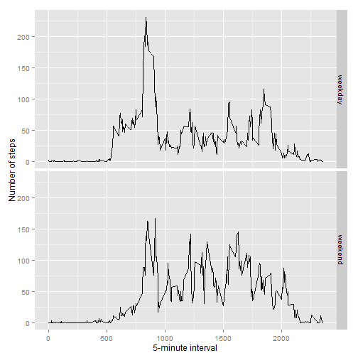

## Loading and preprocessing the data

```r
unzip(zipfile="activity.zip")
data <- read.csv("activity.csv")
```


## What is mean total number of steps taken per day?

The total number of steps taken per day:


```r
# Load the plotting library
library(ggplot2)

# Caculate the total number of steps per day
nbr_steps <- tapply(data$steps, data$date, FUN=sum, na.rm=TRUE)

# Plot the data
qplot(nbr_steps, binwidth=1000, xlab="total number of steps taken each day")
```

 

The mean of the total number of steps taken per day:


```r
# Calculate the mean
mean(nbr_steps, na.rm=TRUE)
```

```
## [1] 9354.23
```

The median of the total number of steps taken per day:


```r
# Calculate the median
median(nbr_steps, na.rm=TRUE)
```

```
## [1] 10395
```


## What is the average daily activity pattern?

Time series plot of the 5-minutes interval and the average number of steps taken, averaged across all days


```r
# Load the plotting library
library(ggplot2)

# Find the average
avg <- aggregate(list(steps=data$steps),
                 list(interval=data$interval),
                 mean, na.rm=TRUE)

# Plot the average
ggplot(data=avg, aes(x=interval, y=steps)) +
    geom_line() +
    xlab("5 min interval") +
    ylab("Average number of steps captured")
```

 

The 5-minutes interval contarining the maximum number of steps:


```r
avg[which.max(avg$steps),]
```

```
##     interval    steps
## 104      835 206.1698
```


## Imputing missing values

The total number of missing values in the data set:


```r
missing <- is.na(data$steps)

# How many missing
table(missing)
```

```
## missing
## FALSE  TRUE 
## 15264  2304
```

Fill the missing values with the mean value of the 5-minutes interval:


```r
f_fill_missing <- function(steps, interval) {
    missing_filled <- NA
    
    if (!is.na(steps))
        missing_filled <- c(steps)
    else
        missing_filled <- (avg[avg$interval==interval, "steps"])
    
    return (missing_filled)
}
copy_data <- data
copy_data$steps <- mapply(f_fill_missing, copy_data$steps, copy_data$interval)
```

Plot a histogram from the filled data that shows the total number of steps taken each day:


```r
nbr_steps <- tapply(copy_data$steps, copy_data$date, FUN=sum)
qplot(nbr_steps, binwidth=1000, xlab="total number of steps each day")
```

 

Calculate the mean of the total number of steps:


```r
mean(nbr_steps)
```

```
## [1] 10766.19
```

Calculate the median of the total number of steps:


```r
median(nbr_steps)
```

```
## [1] 10766.19
```

<b><u>Do these values differ from the estimates from the first part of the assignment?</u></b>
<br />From the plot, we notice a diffence from the estimates in the first part of the assignment

<b><u>What is the impact of imputing missing data on the estimates of the total daily number of steps?</u></b>
<br />It increased the total daily number of steps: the mean and median have higher values because the raw data contained NA values.


## Are there differences in activity patterns between weekdays and weekends?


```r
## Creating a factor of weekday and weekend
f_weekday_or_weekend <- function(date) {
    weekday <- c("Monday", "Tuesday", "Wednesday", "Thursday", "Friday")
    weekend <- c("Saturday", "Sunday")
    
    day <- weekdays(date)
    
    if (day %in% weekday)
      return("weekday")
    else
    if (day %in% weekend)
        return("weekend")
    else
      stop("Invalid date")
}
copy_data$date <- as.Date(copy_data$date)
copy_data$day <- sapply(copy_data$date, f_weekday_or_weekend)
```

Make a panel plot containing a time series plot of the 5-minute interval and the average number of steps taken, averaged across all weekday days or weekend days


```r
avg <- aggregate(steps ~ interval + day, data=copy_data, mean)
ggplot(avg, aes(interval, steps)) + geom_line() + facet_grid(day ~ .) +
    xlab("5-minute interval") + ylab("Number of steps")
```

 
